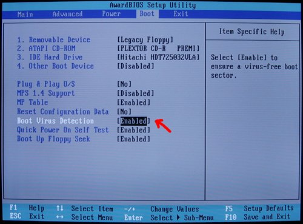
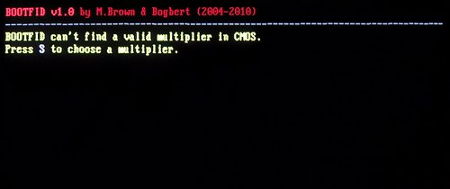
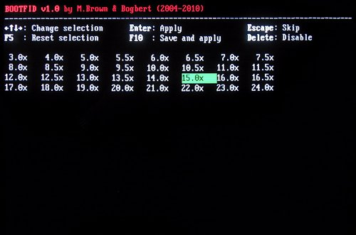
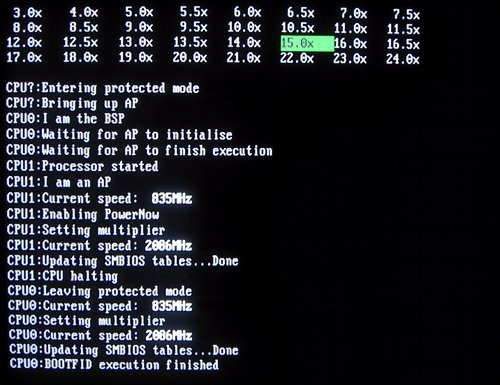
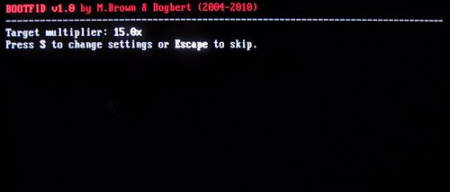

# bootfid

## What is bootfid?

bootfid is an assembly program originally written by Michael Brown to change the CPU multiplier on the MSI K7D motherboard.
The version I propose here features various modifications I made to Michael's code. Notably, I made it work on the Asus A7M266-D which is a motherboard based on the same chipset (the AMD 760 MPX) as the K7D. It is possible that this version of bootfid also works on other motherboards based on this chipset, but I've only tested it on the A7M266-D.
bootfid is meant to run at start-up, you can put it on a bootable floppy disk or directly in the BIOS.

## About the MPX chipset

bootfid is meant to be used on the 760MPX chipset which was released by AMD in 2001.
That's pretty old and I doubt there are many motherboards based on the MPX that are still running nowadays.
These boards were interesting because they were supporting dual processing (they feature two sockets A) and were sold for a relatively affordable price. This was before the arrival of multi-core CPUs and, back then, SMP was almost reserved to very expensive professional rigs.
Officially, dual processing was only supported if the two sockets A were populated with Athlon MP processors. The Athlon MP was a more expensive (and also harder to find) variant of the common Athlon XP. In reality, all versions of the Athlon processor (XP, MP, XP-M) were identical at the silicon level and AMD was cutting fuses (called bridges) in the packaging of the processor to specify its capabilities (such as SMP support or allowed frequencies). Bold users could modify those bridges to change their CPU capabilities, making it possible for instance to do SMP with cheap Athlon XP. For some reason, Athlons XP-M (the mobile version of the Athlon XP) were sold by AMD with a bridge setting that made them SMP capable natively, so they were a cheap alternative to MPs that did not require any modding.

## Why bootfid?

Overclocking is usually the main reason why one would like to change the multiplier of a CPU, but in the case of the MPX boards, there is another very specific reason to do so.
As I said before, running Athlon XP-M processors was a cheap alternative to MP processors. These XP-M processors were normally meant to run on laptops and, to save power, their frequency could vary according to the machine load. Those frequency variations were achieved by changing the CPU multiplier between a min and a max values. Both the min and max multipliers were obtained from the processor bridges: the min multiplier was stored on the same bridges (the L3 bridges) that were used to store the "normal" multiplier for the XP and MP Athlon versions, while the max multiplier was stored on the L6 bridges (that were unused on XP and MP Athlons).
This was very annoying, because the MPX motherboards (at least the A7M266-D) were always setting the CPUs frequency according the L3 bridges, ignoring the L6 bridges. So your XP-M CPUs were running at the minimum frequency (eg. 850MHz) instead of their maximum frequency (eg. 2000MHz).
That's why a software capable of changing the multiplier on the fly to its max value was needed.
Before bootfid, it was already possible to change the multiplier by software once the OS had booted, for example by using CrystalCPUID on Windows.
But being able to do it at boot time, before the OS is started, is a better solution for several reasons: it's OS agnostic, it doesn't screw the OS TSC calibration and it makes faster boots. It seems to be also more reliable (at least for me), because CrystalCPUID used to occasionally crash my PC during transitions, and this never happens when changing the multiplier at start-up.

## Important notice

bootfid only works with Athlons XP-M because only mobile Athlons are capable of changing frequency on the fly. I guess it should be possible to make it work with Athlons XP or MP by modding their bridges to enable the capabilities of mobile Athlons.
Note also that it's not possible to change the multiplier to a value higher than the maximum allowed multiplier defined by the L6 bridges of your CPUs. To bypass this limitation, you have to mod your CPUs (either by tweaking the L6 bridges, or by closing the second L5 bridge).

## How to choose the multiplier used by bootfid?

When building bootfid, it is possible to choose either a fixed multiplier (hardcoded in the bootfid binary) or a multiplier stored in CMOS. That's how bootfid figures out the multiplier to use by default.
But when the bootfid banner appears on screen, the user has a short delay (1 second by default) to press the 'S' key to enter a setup screen where he can select any multiplier. That runtime chosen multiplier is used for the current boot only. Yet, if bootfid was built with the CMOS mode, it is possible to save it to the CMOS to become the new default multiplier.
It is also possible to disable bootfid by choosing 0 as a fixed multiplier, or, in the CMOS mode, by pressing 'Delete' in the setup screen. When disabled, bootfid doesn't apply any default multiplier, it only changes the multiplier when asked by the user from the setup screen.

## The different ways to run bootfid

bootfid is not running from an OS, it is meant to run at boot time, in real mode (well, actually it's temporarily switching to protected mode during it's execution).
The easiest way to give it a try is to install it on a floppy disk and then to boot from that floppy. Once bootfid has run, it jumps to the boot sector of the main hard drive to start the OS.
Another possibility is to build bootfid as an ISA (or PCI) option ROM that can be executed by the BIOS when the PC boots. I have never tested this way of running bootfid, and I'm not even sure that the A7M266-D supports ISA option ROMs. And I have to admit that I don't remember in which state I left the code that handles option ROMs when I stopped working on bootfid (which was in 2010). So I don't recommend trying to run bootfid as an option ROM unless you're ready to get your hands dirty fiddling with some assembly code.
The last and best way to run bootfid is to flash a modded BIOS that runs bootfid at the end of the POST, before jumping to the normal boot drive. Below, you'll find instructions explaining how to patch an A7M266-D BIOS to do that.
That requires some work and a bit of courage as you may brick you beloved machine if you do it wrong.
I would love to provide a patched BIOS image but I can't for obvious legal reasons.

## Running bootfid from a floppy

That's by far the simplest way to test bootfid:
* Download one of the floppy images from the `images` directory
* Unzip it
* Write it to a floppy (on windows, you can use a program named [rawwrite](http://www.chrysocome.net/rawwrite) for that)
* Boot from the floppy

*Choosing the right image:*
The `images` directory contains many images, most of them have in their name a number identifying the default multiplier they provide.
For example, the image named `BootFID_1.0_m125_disk.img` sets the multiplier to 12.5x by default (still, you can change that value on a per boot basis by entering the bootfid setup menu).
The image named `BootFID_1.0_disabled_disk.img` doesn't change the multiplier unless if you enter the bootfid setup menu and select one.
At last, the image named `BootFID_1.0_cmos_disk.img` sets the multiplier to a value stored in the CMOS. When you boot it for the first time, there is no value stored in CMOS, so you should enter the bootfid setup, choose a multiplier and ask to store it in CMOS.
I absolutely recommend against using that latest image on a motherboard other than the A7M266-D because the CMOS location used to stored the multiplier has been selected specifically for that board. It is very possible that this same location is used by the BIOS of an other board to store its own settings.

## Running bootfid from the BIOS

That's the best way to run bootfid, but because I can't distribute a BIOS image (for legal reasons), it requires quite a lot of work. You will have to build bootfid, patch a BIOS image with it, and flash that patched BIOS image to your board.

####  Building bootfid and patching a BIOS image

Required tools:

* the [AwardMod BIOS Manipulation Tool](https://matrix.home.xs4all.nl/reconfig.html) by Josef Hill
* the [Award BIOS Editor](http://awdbedit.sourceforge.net/) by Mike Tedder
* [nasm](https://www.nasm.us)
* bash (or another Bourne shell)
* a C compiler to compile `patch_for_injection.c`

Procedure:

0. Download the bootfid source directory and a BIOS image for the A7M266-D.
   As far as I know, the latest official Asus BIOS image available is the 1011 Beta 005.
   But you can also use an unofficial image like the one released by [Pa3PyX](http://pa3pyx.dnsalias.org/a7m266d_bios.html)
1. Extract the modules of the original BIOS file to a directory using the "AwardMod BIOS Manipulation Tool"
   One of the extracted modules is called `cav_shdw.bin`, that's the BIOS anti-virus module.
   Our goal is to inject bootfid into that module.
   bootfid will be executed just before the anti-virus, which is itself executed at the very end of the POST.
2. Copy the `cav_shdw.bin` file to the bootfid source directory
3. Compile `patch_for_injection.c`
4. Edit the `build_cav_with_bootfid.sh` script, to change (if needed) some variables like the multiplier, the confirmation threshold, ...
5. Run `build_cav_with_bootfid.sh`, a file named `cav_shdw_bf_<vers>_<mult>.bin` is created
6. Copy and rename this file to the "AwardMod BIOS Manipulation Tool" extraction directory to replace the original module
7. Use the "AwardMod BIOS Manipulation Tool" to rebuild a BIOS file
8. Open the BIOS file with the "Award BIOS Editor"
   In "Recognized Item/System BIOS/BIOS ID", edit the Version information and recalc the checksum
   Then save
   You may want to close and restart the "AwardMod BIOS Manipulation Tool", and open the BIOS again to verify that the BIOS has not been corrupted when it was saved (this happened to me once)
9. You now have a patched BIOS image ready to be flashed

## Using a bootfid patched BIOS

Below, we assume that bootfid has been built to store the multiplier in the CMOS, which should be the case unless you have changed the `MULTIPLIER` variable in step 4 of the building process.

1. Flash it.

2. Enter the BIOS setup to make sure "Boot Virus Detection" is enabled (it's located in the "Boot" menu).
This is required because the bootfid code is injected in the BIOS anti-virus module. If the anti-virus is disabled, bootfid won't run at all.

3. At the end of the POST, bootfid displays for 10 seconds a message complaining that it can't find a valid multiplier in the CMOS. This is normal as no multiplier has been saved yet.

While the message is displayed, press 'S' to enter the bootfid setup. There, using the arrows, select the multiplier of your choice and press 'F10'.

bootfid should then change the multiplier of both CPUs and continue the boot sequence.

4. During subsequent boots, bootfid displays a brief message showing the multiplier you chose at step 3, and then it automatically changes the multiplier to this value for the CPUs.

Press 'S' while the message is displayed (be quick, the message lasts just 1 second) to enter bootfid setup, or 'Escape' to continue the boot sequence without changing the multiplier.

Here's a list of the possible interactions in the bootfid setup:
* **Arrows:** to select a multiplier.
* **F5:** to reset the selection to the multiplier saved in CMOS.
* **Enter:** to apply the selected multiplier, but without saving it in the CMOS (so the default multiplier stays the same), and to continue the boot sequence.
* **F10:** to apply the selected multiplier, to save it in the CMOS (it will then become the new default multiplier until you change it again), and to continue the boot sequence.
* **Escape:** to continue the boot sequence without changing the multiplier.
* **Delete:** to continue the boot sequence without changing the multiplier, but also to store to CMOS that not changing the multiplier is the bootfid default behavior from now on.

## The usual disclaimer:
No need to say that bootfid is provided "as is" without warranty of any kind whatsoever, that I shall not be held responsible or liable for any damages resulting from its use. You're using it at your own risk.
